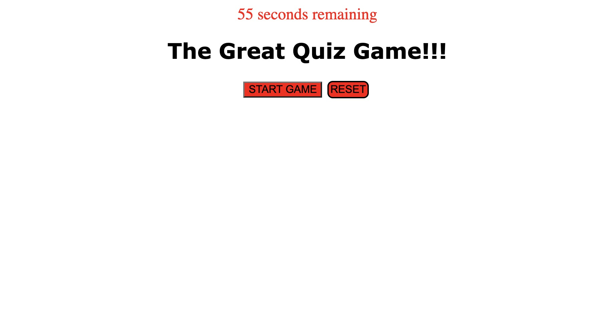

# 04-Homework

Quiz Game using java script.

Description:
The following homework asignment is a game that gives you multiple choice questions in the form of clickable buttons.
In addtion to selecting as many right answers as possible, you are presented with the extra challenge of solving all of them before the time runs out.
If you have the misfortune of selecting the wrong answer, the clock will deduct 10 seconds from the availabkle time. If you run out of time, the game ends.
When you reach the goal of answering all ten questions you will have a chance to put in you initials and have it displayed with your score.
You will then have the option to replay by hitting reset button at any time.

link to github repo. https://github.com/jdesgarennes/04-Homework

Screenshot:

